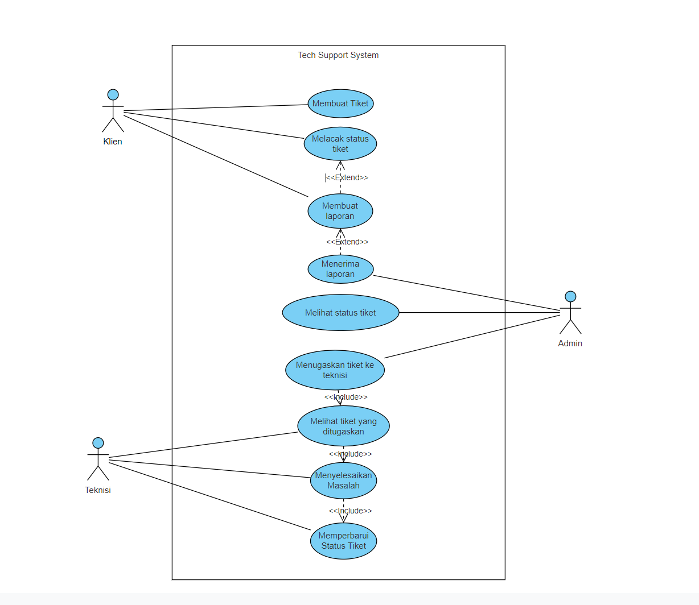

# Tugas KPPL Week 5

**Nama**: Adyuta Prajahita Murdianto

**NRP**: 5025221186

**Kelas**: KPPL E

Tuliskan Requirement dan Model Desain untuk Aplikasi Technical Support System

## **Requirement**

**1. Manajemen Tiket Keluhan**

Aplikasi harus memungkinkan pengguna (klien) untuk membuat tiket keluhan. Tiket ini harus memuat informasi detail tentang masalah yang dihadapi, termasuk kategori masalah dan tingkat prioritas.

**2. Notifikasi dan Pemberitahuan**

Sistem harus memberikan notifikasi otomatis ke teknisi dan admin ketika tiket baru dibuat, diperbarui, atau ditutup.

**3. Penugasan dan Manajemen Teknisi**

Admin dapat menugaskan tiket keluhan kepada teknisi tertentu berdasarkan kompetensi teknisi atau jenis keluhan. Teknisi akan diberi tanggung jawab untuk menyelesaikan masalah tersebut.

**4. Riwayat dan Histori Tiket**

Sistem harus menyimpan riwayat dan histori lengkap dari setiap tiket yang pernah dibuat, termasuk interaksi, solusi, dan waktu penyelesaian. Hal ini penting untuk referensi di masa mendatang dan penilaian kinerja.

**5. Pelaporan dan Statistik**

Sistem menyediakan laporan harian, mingguan, atau bulanan mengenai jumlah tiket yang dibuat, tiket yang diselesaikan, dan statistik terkait kinerja teknisi. Data ini dapat digunakan untuk evaluasi dan perbaikan layanan.

**6. User Roles and Permissions**

Aplikasi mendukung berbagai jenis pengguna seperti klien, teknisi, admin, dan super admin. Setiap jenis pengguna memiliki hak akses yang berbeda sesuai dengan peran masing-masing di dalam sistem.

**7. Tracking Status Keluhan**

Pengguna (klien) dapat melacak status keluhan mereka secara real-time, termasuk melihat siapa teknisi yang menangani masalah mereka dan estimasi waktu penyelesaian.

## **Model**

**Actor**

- `Klien`: Membuat tiket, melacak status tiket.

- `Admin`: Mengelola pengguna, menugaskan tiket ke teknisi, melihat status tiket.

- `Teknisi`: Melihat tiket yang ditugaskan, memperbarui status tiket, menyelesaikan masalah.

**Use Case Diagram**

